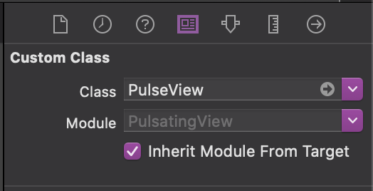

# Pulse-Animation
Pulse animation for iOS using UIKit

[](https://travis-ci.org/ar.warraich@outlook.com/ARAccordionTableView)
[](https://cocoapods.org/pods/ARAccordionTableView)
[](https://cocoapods.org/pods/ARAccordionTableView)

## Example


## Requirements

- iOS 9.0
- Xcode 10.0+
- Swift 4.0+

## How To Use?
### Code:

```swift
class PulseView: UIView {

    var staticView: UIView!
    var overlay1: UIView!
    var overlay2: UIView!

    @IBInspectable var color: UIColor = UIColor.red

    override func awakeFromNib() {
        super.awakeFromNib()

        setupSubView()
    }

    func setupSubView() {
        overlay1 = UIView()
        overlay2 = UIView()
        staticView = UIView()

        staticView.backgroundColor = color
        overlay1.backgroundColor = color.withAlphaComponent(0.5)
        overlay2.backgroundColor = color.withAlphaComponent(0.2)

        addSubview(overlay1)
        addSubview(overlay2)
        addSubview(staticView)

        sendSubviewToBack(overlay1)
        sendSubviewToBack(overlay2)
    }

    override func layoutSubviews() {
        super.layoutSubviews()

        staticView.layer.cornerRadius = staticView.bounds.width / 2
        overlay1.layer.cornerRadius = overlay1.bounds.width / 2
        overlay2.layer.cornerRadius = overlay2.bounds.width / 2
    }

    override func draw(_ rect: CGRect) {
        super.draw(rect)

        overlay1.removeFromSuperview()
        overlay2.removeFromSuperview()
        staticView.removeFromSuperview()

        setupSubView()

        overlay1.frame = bounds
        overlay2.frame = bounds
        staticView.frame = bounds

        UIView.animate(withDuration: 1.2, delay: 0.0, options: [.autoreverse, .repeat], animations: {
            self.overlay1.transform = CGAffineTransform(scaleX: 1.5, y: 1.5)
            self.overlay1.alpha = 0.5

            self.overlay2.transform = CGAffineTransform(scaleX: 2, y: 2)
            self.overlay2.alpha = 0.3
        }, completion: nil)
    }

}
```

### Storyboards:
If you're using Storyboards/Interface Builder you can create a `PulseView` instance by adding a normal UIView to your Storyboard, and then manually changing the view's class to `PulseView` in the "Custom Class" field of the Identity Inspector tab on the Utilities panel (the right-side panel).



### Customisation:
`PulseView` includes support for IBInspectable, to allow configuration of the color inside Interface Builder/Storyboards


## Author
Schaheer Saleem,
